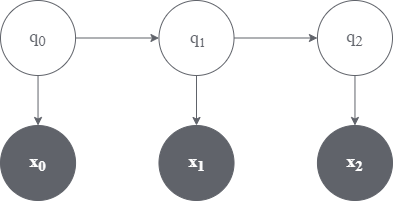

# hmm-ocr
A hidden markov model based optical character recognizer 



## Character-transition model
Assumption: Each character t+1 is conditionally independent of all other characters given the character t

##  Image-Emission model summary:
Assumption: Each pixel is conditionally independent given the observed character

```
  Likelihood: pixel-matched ~ Binomial(n, mu)
  Prior: mu ~ Beta(alpha, beta)
  Posterior: mu|data ~ Beta(alpha+x, beta+n-x)
  Bayesian Solution: P(pixel-matched|mu) =  (alpha + x) / (alpha + beta + n)
  where x: number of pixels that matched
        n: total number of pixels
    alpha: pseudocount for matched pixels
    beta: pseudocount for pixels that were not matched
  If, we have seen no data at all
    P(pixel-matched|mu) =  (alpha) / (alpha + beta)
```
